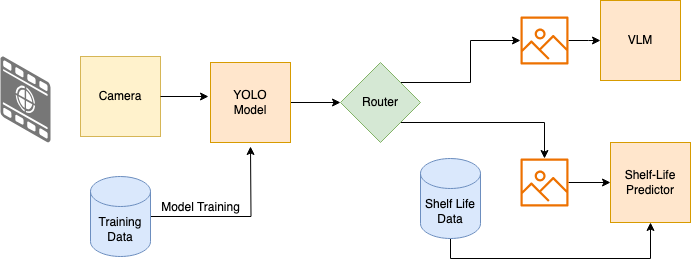

# 🛒 FMCG-Insight-AI

A real-time computer vision system to detect FMCG and grocery items, extract critical metadata (like expiry date, MFG, and price), and dynamically predict the freshness of perishable products.
## Architecture Diagram


## Demo Video


## 🚀 Features

- 🧠 **Object Detection** of FMCG and groceries using YOLOv5/YOLOv8
- 🔍 **OCR Extraction** of product details (EXP, MFG, Price)
- 🍏 **Freshness Prediction** for grocery items using CNN + ANN
- 🧾 Real-time analysis via camera input or pre-captured images
- 🔁 Modular routing to handle different pipelines based on object type

## 🧱 Architecture Overview

```
[ Camera ] ↓ 
[ YOLO Model (Object Detection) ] ↓ 
[ Router (FMCG / Grocery) ] 
├──> FMCG → [OCR via VLM / Groq API / Tesseract] 
└──> Grocery → [Shelf Life Predictor (CNN + ANN)]
```

## 🧰 Tech Stack

| Component         | Technology Used                               |
|------------------|------------------------------------------------|
| Object Detection | YOLOv5 / YOLOv8, PyTorch, Roboflow             |
| Shelf Life Model | CNN + ANN, TensorFlow/Keras                    |
| OCR              | Tesseract, Groq API, Donut / Pix2Struct (VLMs) |
| Routing/Glue     | Python, OpenCV, FastAPI (optional)             |
| Visualization    | Matplotlib, Streamlit (optional)               |

## 📁 Dataset Sources

- 📦 **FMCG Dataset**: Custom-labeled using [Roboflow](https://roboflow.com)
- 🥬 **Grocery Dataset**: Images of perishable items with labeled freshness
- 📅 **OCR Examples**: Product labels with MFG, EXP, and pricing details

## 🧪 Model Training

- **YOLO Object Detection**:
  - Trained separately on FMCG and grocery datasets.
  - Loss functions include Bounding Box Loss, Objectness Loss, and Class Loss.
  - Input preprocessed with resizing, augmentation (flip, blur), and normalization.

- **Shelf Life Prediction (CNN + ANN)**:
  - CNN extracts features from input images (like discoloration, texture).
  - ANN maps features to a regression/classification label (freshness level or days).
  - Trained using mean squared error (MSE) loss.

- **OCR Pipeline**:
  - **Tesseract**: Basic text extraction, low accuracy.
  - **VLMs** (e.g., Donut, TrOCR, Pix2Struct): High-accuracy OCR using Vision-Language models, but computationally heavy.
  - **Groq OCR API**: Cloud-based high-speed and high-accuracy solution.

## 🔍 Examples

| Task              | Example Output |
|-------------------|----------------|
| Detected Product  | `Nestle Milk` with bounding box |
| Extracted OCR     | `EXP: 12/08/2024`, `MFG: 01/06/2024`, `Price: ₹42` |
| Freshness Output  | `Apple - Freshness Score: 8.5 / 10` |

## 🔄 Future Work

- 📦 Barcode/QR Code detection & decoding
- 🔊 Voice-based feedback system for expired items
- 📱 Android/Web interface for real-time scanning
- 🧠 LSTM/CNN-LSTM for time-series freshness prediction

## 💡 Project Motivation

Automating quality assurance and stock management in retail and grocery sectors using AI. This system helps reduce food waste, improve customer safety, and streamline shelf audits.

## 🛠️ Installation & Setup

### Prerequisites
- Python 3.8+
- PyTorch 1.8+
- CUDA (optional, for GPU acceleration)

### Installation
```bash
# Clone the repository
git clone https://github.com/yourusername/SmartShelfVision.git
cd SmartShelfVision

# Create and activate virtual environment
python -m venv venv
source venv/bin/activate  # On Windows: venv\Scripts\activate

# Install dependencies
pip install -r requirements.txt

# Download pre-trained models
python download_models.py
```
<!-- 
### Usage
```bash
# Run with webcam
python main.py --source 0

# Run with image file
python main.py --source path/to/image.jpg

# Run with directory of images
python main.py --source path/to/image/directory
``` -->
<!--  -->
## 🤝 Contributing

We welcome contributions! Feel free to fork the repo, open issues, or submit pull requests.

1. Fork the repository
2. Create your feature branch (`git checkout -b feature/amazing-feature`)
3. Commit your changes (`git commit -m 'Add some amazing feature'`)
4. Push to the branch (`git push origin feature/amazing-feature`)
5. Open a Pull Request

## 📜 License

This project is licensed under the MIT License. See `LICENSE` for more details.

## 🙌 Acknowledgements

- [YOLO by Ultralytics](https://github.com/ultralytics/yolov5)
- [Hugging Face Transformers](https://huggingface.co)
- [Groq API](https://www.groq.com/)
- [Tesseract OCR](https://github.com/tesseract-ocr/tesseract)